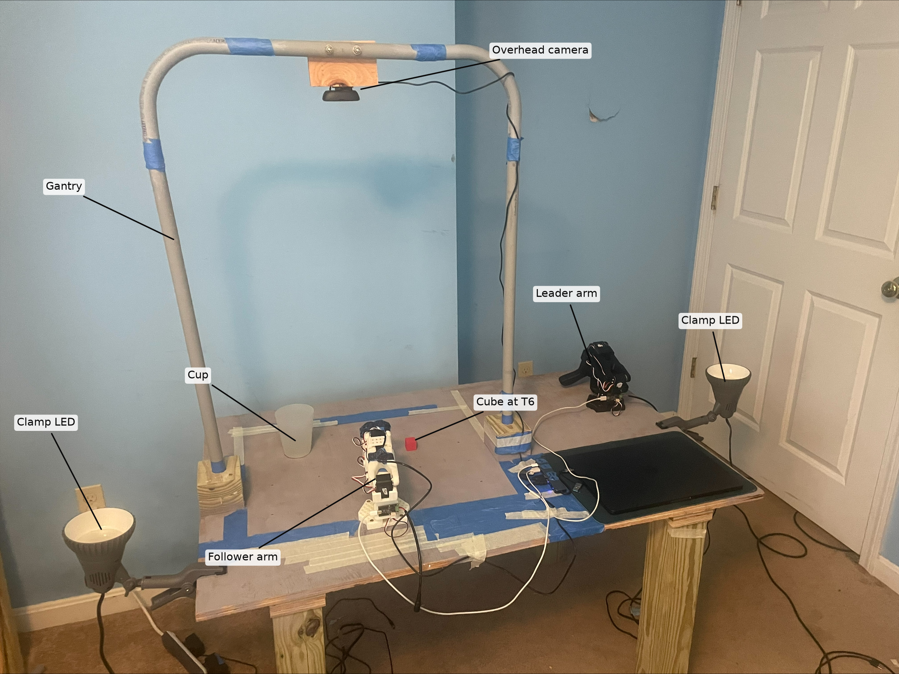

# Pre-registered Protocol for SO-101 Experiment

*Original pre-registration amended August 8, 2026 on the rebuilt workstation, before any data
collection. §1 through §7 were fixed before the first training episode was recorded. Amendments
1 to 13 predate that episode; 14 onward are dated and state which data they precede.*

## 1. Apparatus

- **Arm:** SO-ARM101 Pro (Feetech STS3215 servos); follower 12 V, leader 5 V teleoperation.
- **Cameras:** overhead Logitech C270 and wrist Seeed USB webcam, both 640 x 480 @ 30 fps. The
  overhead camera is rigidly mounted on a fixed gantry covering a **22 x 17 in** area. Camera
  position is locked for the duration of the study.
- **Work surface:** plywood in flat gray primer.
- **Cube:** 1 inch foam cube (Teacher Created Resources). All colors are the same product,
  identical in size, shape, mass and finish.
- **Cup:** 4.5 in tall, 2.5 in base, 3.5 in rim. Fixed at **(5.0, 12.5)** throughout.
- **Coordinate frame:** inches from the front-left corner of the overhead frame. The follower is
  clamped to the front edge (y = 0), centered at **x = 11.0**.
- **Arm home pose:** fully retracted, base forward, joints folded, gripper visible in the
  overhead frame. Every episode starts here.
- **Lighting (baseline):** blinds closed, room lights off, two clamp LEDs (**1000 lm each,
  4000 K, CRI 80**) bounced off the ceiling from both sides. Used for all training
  demonstrations and four of the five evaluation cells.

 

*The apparatus. Unlabeled version at `media/bench_wide.jpeg`.*

 
 
 

*The two views the policy receives, at the resolution it receives them, and the arm home pose.*

## 2. Cube positions (locked)

 

**Training positions (10)**, used by the Randomized condition, 5 demos each:

| ID | (X, Y) | | ID | (X, Y) |
|----|--------|---|----|--------|
| T1 | 2.0, 2.5 | | T6 | 15.5, 10.0 **Clean fixed position** |
| T2 | 6.5, 7.5 | | T7 | 15.5, 14.25 |
| T3 | 8.5, 15.0 | | T8 | 20.5, 2.5 |
| T4 | 12.0, 14.0 | | T9 | 20.5, 6.5 |
| T5 | 15.5, 2.5 | | T10 | 20.5, 10.0 |

**Held-out positions (5)**, used only by the New Positions cell, 3 episodes each:

| ID | (X, Y) | Relation to training convex hull |
|----|--------|----------------------------------|
| E1 | 2.0, 7.5 | **outside** (extrapolation) |
| E2 | 6.5, 2.5 | on the boundary (front edge, between T1 and T5) |
| E3 | 12.0, 10.0 | inside (interpolation) |
| E4 | 15.5, 6.5 | inside (interpolation) |
| E5 | 19.5, 13.5 | **outside** (extrapolation) |

The training hull has vertices (2, 2.5), (20.5, 2.5), (20.5, 10), (15.5, 14.25), (8.5, 15).
Interpolation and extrapolation are reported separately. The assignment above was confirmed
computationally against the hull after collection.

All 15 positions are marked identically and never redrawn. Two further marks (P1, P2) were added
after all registered rollouts and erased afterwards, per §8.15.

## 3. Independent variables (what changes)

Data-collection strategy across four conditions. Each varies exactly one factor; everything else
matches Clean.

1. **Clean.** All 50 demos identical: red cube at **T6 (15.5, 10)**, baseline lighting, every demo
   a first-try success.
2. **Randomized (position).** Only start position varies, over the 10 training positions, cycled
   T1 to T10 in five complete passes. Cycling rather than blocking keeps position from being
   confounded with drift in teleoperator skill. T6, the Clean position, is one of the 10.
3. **Recovery.** Identical to Clean except that 20 of the 50 demos include a deliberate mid-carry
   release from **4 to 5 inches** above the surface, a re-grasp from wherever the cube lands, and
   completion. The release is deliberate rather than a natural slip, so the learned behavior
   reflects a clean drop whose dynamics may differ from a real failed grasp. Specified at roughly
   the midpoint of the carry; measured post hoc at about 65% (§8.24). Recovery demos are demos 2
   and 4 of each consecutive group of 5, so the behavior is not confounded with fatigue.
4. **Color-varied.** Only cube color varies: five colors for 10 episodes each (red, orange,
   yellow, blue, purple), cycled ten times. Green is held out for evaluation and removed from the
   workspace during all training collection.

 

*The five training colors plus the held-out green. All six separate cleanly against the gray
primer, which is why the background was changed from blue tape (§8.3).*

Because positions and colors are cycled deterministically, every episode's factor level is
recoverable from its index: Randomized episode *i* uses T[((i-1) mod 10) + 1], Color-varied
episode *i* uses the ((i-1) mod 5)+1'th color. A re-recorded demonstration reuses the same
position or color, so the correspondence holds.

## 4. Fixed variables (confound control)

1. **Model:** SmolVLA, fine-tuned from `lerobot/smolvla_base`.
2. **Task:** pick up the cube and place it in the cup.
3. **Budget:** 50 training episodes per condition for the original four conditions; additional
   episodes for the density sweep as described in §8.32. 15 scored evaluation episodes per cell
   for the original grid; the density sweep evaluation is specified in §8.32.
4. **Hardware:** camera position and framing, gripper, control frequency.
5. **Arm home pose** and **baseline lighting** as in §1.
6. **Reset:** the cube is replaced by hand onto its marked position between episodes.
7. **Training hyperparameters:** identical across conditions. `batch_size=32`, `steps=10000`,
   `save_freq=2000`, `policy.device=cuda`, and the same `rename_map` (`overhead` to `camera1`,
   `wrist` to `camera2`). Optimizer AdamW, `lr=1e-4`, betas (0.9, 0.95), eps 1e-8, weight decay
   1e-10, grad clip norm 10.0. Scheduler `cosine_decay_with_warmup`, configured
   `scheduler_warmup_steps=1000` and `scheduler_decay_steps=30000`, auto-scaled at construction to
   333 and 10000 (§8.29), `scheduler_decay_lr=2.5e-6`. Policy `n_obs_steps=1`, `chunk_size=50`,
   `n_action_steps=50`, `num_steps=10`, `num_expert_layers=0`, `expert_width_multiplier=0.75`,
   `freeze_vision_encoder=true`, `train_expert_only=true`. LeRobot 0.5.2, Python 3.12.13, dataset
   `CODEBASE_VERSION` v3.0. The seed is identical across conditions within a replication and is the
   only setting varied between them: 1000 primary, 2000 replication (§6.9, §8.14). Conditions are
   never compared across seeds. The resolved config for each run is released with the code; §8.29
   records what the defaults turned out to be and where the resolved config is not sufficient to
   establish them.
8. **Checkpoint:** the final checkpoint at step 10000, for every condition. No best-loss or
   early-stopped selection.
9. **Compute:** a single A100 per run.
10. **Recording window:** `episode_time_s = 45`, `reset_time_s = 15`, everywhere. During
    collection the window is a ceiling, not a target: recording ends as soon as the cube is in the
    cup. It accommodates recovery demos without truncation and matches the evaluation window in
    §6.7.
11. **Language instruction:** verbatim identical for every demonstration and every rollout:
    `Pick up the cube and place it in the cup`
12. **Inference:** `policy.device=mps`, `strategy.type=episodic`,
    `strategy.reset_to_initial_position=true`, `chunk_size=50`, `n_action_steps=50`,
    `dataset.fps=30`, `episode_time_s=45`, `reset_time_s=15`, identical for every policy and cell.
    The policy executes all 50 actions of a chunk before the next forward pass, an open-loop chunk
    rather than a receding horizon, so the action-update rate is **0.600 Hz**, one decision every
    1.67 s. Playback therefore shows brief holds at chunk boundaries. The 45 s window is wall
    clock, but frames are recorded only while a chunk executes, so a full-length episode is 1151
    frames, 38.4 s of motion in 23 chunks, and every duration computed from recorded data is
    execution time rather than elapsed time. The 6.6 s residual over 23 chunks puts the forward
    pass at **288 ms**. Flow-matching inference draws `num_steps = 10` sampling steps per forward pass, so inference is
    stochastic at fixed weights and fixed observation.
13. **Warmup episodes:** each cell records 16; index 0 is discarded unscored, so the 15 scored
    episodes are indices 1 to 15. The first forward pass in a process pays a one-off Metal kernel
    compilation cost that later passes do not, which would otherwise penalize the first episode of
    every cell. The rule is pre-committed (§8.13), unconditional and outcome-independent, so it
    stands whatever that cost was on a given run.

Changing any of these mid-study invalidates the comparison. Held-out rule: evaluation instances
differ from anything seen in any training condition.

## 5. Evaluation

All four policies are evaluated on five cells: one in-distribution reference and four held-out.

1. **In-distribution.** Cup and red cube only, baseline lighting, cube at T6, identical across all
   15 episodes.
2. **New Positions.** The cube starts at the 5 held-out positions, in order, 3 episodes each.
   Reported overall and split by interpolation (E2, E3, E4) against extrapolation (E1, E5). E2
   lies on the front edge of the hull and is grouped with interpolation. The position identifier
   is recorded per episode.
3. **Reduced Lighting.** The left LED is switched off; the right is unchanged. Blinds stay closed
   and room lights off. Mean grayscale intensity of the overhead frame falls from **144.8 to
   101.0**, a 30% reduction in the recorded image and, because the cameras auto-expose, a lower
   bound on the reduction at the surface. The manipulation is therefore both less light and a
   shift from symmetric to one-sided shadow. Cube at T6, same fixture off for all 15 episodes and
   all four policies.

 
 

*Baseline (both LEDs) and Reduced Lighting (one LED), as recorded.*

4. **Different object.** The red cube is replaced with a green cube of the same 1 inch foam type,
   at T6, baseline lighting, 15 episodes.
5. **Distractors.** Four objects at fixed marked positions, identical across all 15 episodes:
   crumpled paper at T2 (6.5, 7.5), penny at T4 (12.0, 14.0), battery at E4 (15.5, 6.5), screw at
   T8 (20.5, 2.5). The red cube starts at T6 under baseline lighting; only the distractors change.
   They span a range of size, shape, color and material. Three of the four sit at Randomized
   training positions, making the cell adversarial specifically for that policy while the other
   three conditions see them as unfamiliar objects. The asymmetry is intentional and is accounted
   for in interpretation.

 
 

## 6. Pre-committed metrics

1. Task success rate per (condition x eval cell).
2. Per-cell rates with Wilson 95% confidence intervals.
3. 15 episodes per cell.
4. Primary comparison is the **generalization gap:** in-distribution success minus mean held-out
   success.
5. **Matched-axis comparisons (key results):** Randomized against Clean on New Positions, and
   Color-varied against Clean on Different object. Each reported as a difference in success rate
   with a Newcombe hybrid score interval and a Fisher exact test. Reduced Lighting and Distractors
   are cross-transfer cells no condition trained on; for these we report whether any condition
   generalizes to an unseen axis.
6. **Success:** the cube is released into the cup and rests there, cup upright.
7. **Episode:** a 45 s window in which the arm may complete the task. Meeting #6 ends the episode
   as a success; otherwise it is a failure at 45 s. The arm may retry inside the window. Knocking
   the cup over is an immediate failure, as is putting the cube outside the reachable and visible
   area.
8. **Scoring:** live, against #6, at the time of the rollout. All video is retained; anything
   judged ambiguous at the time is flagged and re-scored from video before analysis. For New
   Positions the position identifier is recorded alongside the score.
9. **Seeds:** seed 1000 is run first and reported. Further seeds are added if time permits, and
   the number actually run is reported for every condition (§8.14). No claim is conditioned on how
   many seeds are obtained.

## 7. Naming (locked)

- **Training datasets:** `cube-pickup-{clean,randomized,recovery,color,density}_{YYYYMMDD_HHMMSS}`
  for the original conditions and the density probe. The density sweep in §8.32 records one pool,
  `cube-pickup-densitypool_{YYYYMMDD_HHMMSS}`; the four training budgets are subsets of that pool
  selected by the §8.32 rule and are not separately recorded datasets. An interrupted session
  resumes into the same repository, so exactly one pool dataset exists.
- **Policies:** `smolvla-cube-{condition}` at seed 1000, `smolvla-cube-{condition}-seed2000` at
  seed 2000. Exploratory policies carry a descriptive suffix (`smolvla-cube-color-slowpace`).
- **Sweep policies:** `smolvla-cube-density{N}` at seed 1000 and `smolvla-cube-density{N}-seed2000`
  at seed 2000. Fixed-step control runs carry the suffix `-fixedstep`.
- **Rollout datasets:** `rollout_{policy}_{cell}_{timestamp}`, retained for offline analysis.

LeRobot appends the timestamp itself in both cases; the analysis tooling requires exactly one.
Where a condition was collected more than once the timestamp is the disambiguator, and the
retained dataset is named in §8.

## 8. Amendments

*1 to 13 predate all data collection. 14 to 17 fall between the seed 1000 and seed 2000 grids.
18 to 29 are analysis-stage. 30 precedes the data it describes. Supporting measurements are in
`analysis/README.md`.*

### Before any data was collected (August 8, 2026)

1. **Workspace geometry.** The irregular reachable region replaced "4 corners and 6 interior
   spots" with the 10 training and 5 held-out positions in §2, and interpolation status is now
   reported.
2. **Color-varied rebalanced** from red x14 plus three colors x12 to five colors x10.
3. **Background** changed from blue tape to gray primer; a blue cube on blue tape would have
   confounded the Color-varied condition.
4. **Lighting cell** cut from three levels to one. Nothing brighter than baseline was available,
   "normal" is already the in-distribution cell, and switching off both LEDs would test response
   to absent visual input rather than a lighting change. Verified at a 30% reduction before
   collection (§5.3).
5. **Scoring** changed from post-hoc video review to live scoring, with all video retained.
6. **Seeds** wording changed to commit to reporting the number run rather than to a number; seed
   fixed at 1000.
7. **Recovery condition** given an operational definition (drop point and height).
8. **Demo ordering** specified as cycling rather than blocking.
9. **Recovery demo placement** moved from the last 20 demos to demos 2 and 4 of each group of 5.
10. **Training hyperparameters, seed and checkpoint selection** added to §4.
11. **Recording window and language instruction** added to §4. The original risked truncating
    recovery demos and left the instruction string, a model input, unfixed.
12. **Matched-axis comparisons** now specify an interval on the difference and a Fisher exact
    test; overlapping per-cell intervals are not a test of a difference.
13. **A 16th warmup episode** per cell, pre-committed to be discarded.

### Between the two grids (August 11, 2026)

14. **Seed 2000 replication.** The full 20-cell grid repeated with the seed 2000 policies, trained
    August 9 with identical settings. Reported per seed, never pooled. Cell order fixed in advance
    (In-Distribution, Different Object, Distractors, Reduced Lighting, New Positions), independent
    of any observed outcome. Physical scene unchanged. Stated before any seed 2000 data.
15. **Displacement probe, exploratory.** Clean at both seeds evaluated at P1 (15.5, 9.0) and P2
    (15.5, 8.0), on the line from T6 to E4, 8 scored episodes each. The registered held-out set
    places every position at least 3.5 in from T6, so 0/60 on New Positions cannot distinguish a
    near-zero generalization radius from a boundary inside that gap. Stated before the probe ran.
    *Completed August 14: the marks were made in erasable pencil only after all 600 registered and
    30 slow-pace rollouts, so they appear solely in the 32 probe episodes, where their presence is
    part of the manipulation. They were erased afterwards and the board was photographed before,
    during and after (`media/before_marking.jpg`, `media/marked_board.jpg`,
    `media/overhead_marks_erased.jpg`). This supersedes an earlier entry logging the erasure as
    outstanding.*
16. **Demonstration pace probe, exploratory.** The superseded Color collection
    (`cube-pickup-color_20260809_130649`, 23.0 s per demonstration) and its policy
    `smolvla-cube-color-slowpace` evaluated on In-Distribution and Different Object against the
    retained Color policy (16.6 s). Separate collection sessions, so pace is the measured
    difference but not the only one. Never pooled into the grid. Stated before the probe ran.
17. **Failure-mode vocabulary fixed.** Free-text failure notes were normalized against nine terms:
    success, success_after_recovery, no_departure, contact_no_grasp, grasp_drop, deliberate_drop,
    cube_out_of_bounds, cup_knocked, timeout_other. Binary success values were fixed at rollout
    time and none changed. Superseded by §8.21 and §8.27.

### Analysis stage (August 12 to 14, 2026)

18. **Color-varied re-collected, August 9**, before any Color policy was trained. The teleoperator
    had deliberately slowed the first collection to match the episode length of the conditions
    already recorded, and overshot: 23.0 s per demonstration against 18.6 s for Clean, so pace
    rather than color would have been the largest difference between that dataset and the rest. It
    was re-collected the same day with no timing control, matching the other three conditions, and
    came out faster still at 16.6 s, partly because it was the last session recorded. Retained:
    `cube-pickup-color_20260809_183224`. The superseded collection is reused as the pace probe
    (§8.16) and no episode from it enters any four-condition analysis. It was never a designed
    condition, which is why `scripts/record_dataset.sh` does not accept `color-slowpace`.
19. **Randomized collection interrupted and resumed, August 10.** The session crashed after 41
    episodes and resumed at the next index with the cube at T2, the position the §3 cycle assigns,
    with no other change. The index to factor-level mapping was confirmed against the recordings
    and independently against the calibration in §8.23, which recovers all ten positions with a
    within-position base rotation spread of 0.38 to 1.93 degrees. A one-step offset would have
    scattered the affected grasps across positions tens of degrees apart.
20. **Re-record rules, stated August 10.** *Demonstrations:* §3 requires every demonstration to be
    a first-try clean success, so one judged not clean at the time was discarded and re-recorded.
    That implements the specification rather than deviating from it, but the judgement was made in
    the moment without a written rubric and the count was not logged. Demonstrations were also
    re-recorded for pre-outcome faults: a dropped teleoperation link, the cube off its mark, a
    stray object on the surface, or a control misfire. Every re-record reuses the same position or
    color.

    *Evaluation:* approximately five rollouts, fewer than ten. The exact count is not recoverable,
    since a re-record replaces the discarded take. One was because a pencil had been left in the
    overhead frame, so the scene did not match §5. One is the outcome-dependent case in §8.26. The
    rest were control misfires, where a right-arrow press as an episode ended made the harness
    prompt for a recording and a reset at once and the next episode never started. No inference
    ran and the arm was completely inert, which is how a misfire is distinguished at the time from
    a scored `no_departure` episode, in which the policy runs and the arm vibrates without
    departing.
21. **Vocabulary corrected and extended.** §8.17 conflated two outcomes and used "recovery" for
    the case that is *not* the Recovery condition's demonstrated behavior. Both were renamed:
    **success_after_missed_grasp** (was success_after_recovery), where the initial grasp failed
    and the policy re-approached, never having held the cube; and **success_after_drop** (was
    success_after_regrasp), where the policy grasped, released during the carry, recovered and
    completed, reproducing the demonstrated behavior. The vocabulary is therefore ten terms. Both
    score as successes and no binary value changed. The split is supported by the data: all six
    success_after_drop episodes come from recovery-seed2000 while the six
    success_after_missed_grasp episodes are spread across four policies, and the release detector
    separates the two families in the same direction. `tools/export_results.py` applies both
    renames on every run and refuses to write if any label falls outside the ten terms.
22. **Instrument validation of the live labels, post hoc.** Three label families were checked
    against joint telemetry from the same episodes: `no_departure` against arm-joint departure,
    the drop labels against a release detector calibrated on the recovery demonstrations, and the
    joint-to-bearing calibration against two independently known locations, the cube at T6 and the
    cup. One episode was recoded. Recall, specificity, calibration error and the detector's blind
    spot are in `analysis/README.md`.

    The 20 degree departure threshold was chosen by sweeping candidates against the labels across
    all 662 episodes. The groups do not overlap: the largest maximum joint deviation among
    `no_departure` episodes is 15.9 degrees, the smallest among departing episodes is 59.5, so
    every threshold from 16 to 59 reproduces all 662 labels. 20 is the conservative end of that
    band.
23. **Azimuth-based trajectory analyses declared exploratory.** Base rotation is mapped to
    workspace bearing by a linear fit on the 50 Randomized training grasps, whose cube positions
    are known. Four analyses use it: trajectory envelope, per-cell aim invariance, aiming error by
    interpolation against extrapolation, and release bearing. All are post hoc, none
    pre-registered, and all derive from the recorded `action` column, which is commanded rather
    than achieved joint position (§9). The 2D joint-to-position map is too weak to use
    quantitatively, so radial claims are stated in joint angles only. Coefficients and validation
    error are in `analysis/README.md`.
24. **Correction to §3.** The recovery drop was specified at roughly the midpoint of the carry;
    measured across the 20 demonstrations it sits at about 65%. §3 described intent and execution
    was consistently later. The Recovery policy's own releases land within one degree of the
    demonstrations, so the inheritance claim is unaffected and §3 is left as written.
25. **Correction to §4.12.** The section originally stated roughly 3 Hz at approximately 25 fps.
    With `n_action_steps = 50` and `dataset.fps = 30` the true rate is 0.600 Hz. The underlying
    settings were fixed before collection and are unchanged; only the derived description was
    wrong.
26. **One evaluation episode re-recorded on an outcome-dependent judgement**, logged August 13
    (randomized, seed 1000, in_distribution, episode 2). The arm did not depart and the
    experimenter, unsure whether that counted as an episode, re-recorded it. Unlike the control
    misfires in §8.20 this was not outcome-independent, hence the separate entry. §6.7 already
    answers the question: an episode that does not meet the criterion inside the window is a
    failure whether or not the arm moved. Both takes scored a failure, so the binary value is
    unchanged; the retained take departed and timed out, moving one episode from `no_departure` to
    `timeout_other`. The rule is stated explicitly here, and is how all 50 `no_departure` episodes
    are treated.
27. **Success labels audited, one transposed pair corrected, August 14.** Every scored episode was
    screened against two telemetry criteria independent of the label being tested: episode
    duration, and the presence of a gripper release inside the cup's angular half-width. Two
    adjacent episodes were flagged (color / in_distribution / seed 1000 / episodes 8 and 9) and
    both were re-scored from video under §6.8. Their labels were transposed: 8 is a
    `contact_no_grasp` failure and 9 is a success. Episodes 10 and 11 were also reviewed and match,
    ruling out a wider offset. Because the swap exchanges one success for another inside the same
    cell, no rate, interval or test statistic changed. No other episode in the 662 was flagged by
    both screens, and none of the 45 density episodes added on August 22nd were flagged either.
    This supersedes the statements in §8.17 and §8.21 that no binary success value
    was ever changed: two were, both found by telemetry rather than by inspecting outcomes.
28. **Vocabulary precedence rule, August 14.** An episode is labeled by its first decisive event.
    A cube that was held and then released is `grasp_drop` regardless of where it came to rest,
    and `cube_out_of_bounds` is reserved for episodes in which the cube leaves the workspace
    without ever having been held.
29. **Training configuration verified from the resolved configs, August 14.** §4.7 fixed the
    hyperparameters by naming LeRobot's defaults rather than enumerating them. The nine resolved
    configurations were diffed afterwards and are released with the code; a tenth, for the density
    probe in §8.30, was added August 22 and differs in the same fields. Four things they
    establish, none of which changes any setting:
    - They differ only in `output_dir`, `seed`, `dataset.repo_id`, `job_name` and `wandb.run_id`,
      which is the machine-checkable form of the claim in §4.7.
    - **Only the action expert is trained.** The SmolVLA defaults set `freeze_vision_encoder: true`
      and `train_expert_only: true`, and LeRobot's `set_requires_grad()` places the whole
      vision-language backbone in eval mode with `requires_grad=False`. Roughly 100M of 450M
      parameters are trainable, so all policies share an identical perceptual front end and
      every behavioral difference is attributable to the action expert.
    - **The learning-rate schedule was auto-scaled to the run   length**  The resolved configs carry 
      `scheduler_decay_steps: 30000` and `scheduler_warmup_steps: 1000` against a 10000 step run, which 
      was originally read as leaving the checkpoint near 79% of peak learning rate, which was wrong.
      `CosineDecayWithWarmupSchedulerConfig` scales warmup and decay steps when the number of
      training steps is below `num_decay_steps`, and the scaling happens when the scheduler is
      constructed rather than when the config is resolved, so the config file cannot show it. The
      effective schedule was 333 warmup and 10000 decay steps. The `train/lr` series in Weights and
      Biases confirms this, as the final logged learning rate is 2.7236e-6 against `decay_lr` of 2.5e-6,
      where an unscaled 30000 step horizon would have put step 9800 near 7.9e-5, a factor of 30
      apart. Every evaluated checkpoint is therefore fully annealed. No setting changed and no
      result changes; this corrects the description only, and supersedes the 79% figure wherever it
      appears. *Corrected September 7, 2026.*
    - **The policy carries a third image slot that no dataset fills.** `input_features` lists
      `camera1`, `camera2` and `camera3`, inherited from the `smolvla_base` configuration. Every
      dataset in the study provides two cameras, `overhead` and `wrist`, which the `rename_map`
      sends to `camera1` and `camera2`; no recorded camera populates the third. Identical across
      all runs, so no comparison is affected. *Noted August 22, 2026.*

### New data (August 22, 2026)

30. **Sampling density probe, exploratory.** A fifth collection condition and a tenth policy:
    50 demonstrations at two positions, 25 at T6 (15.5, 10.0) and 25 at T2 (6.5, 7.5), alternating
    by zero-based index, even at T2 and odd at T6, so the assignment is recoverable from the index
    as in §3. T2 sits on the opposite side of the arm from T6, about −31.0 against +24.2 degrees
    of base bearing, so no fixed sweep succeeds at both and the policy must use the image to
    choose a direction. Everything else matches Clean, including the §4.7 training settings at
    seed 1000. Named `cube-pickup-density_{timestamp}` and `smolvla-cube-density` per §7.
    Evaluation is three cells at 16 episodes each, 48 rollouts, in this order fixed in advance per
    §8.14: In-Distribution at T6, the same scene at T2, and New Positions over the five held-out
    positions. The question is whether 25 demonstrations at a position recovers Clean-level
    execution where 5 did not, placing the floor price in §6 between 5 and 25 per position.
    Confounds: a separate session two weeks later with a more practiced teleoperator, and a single
    seed. Outside the pre-registration, never pooled into the grid, compared to Clean
    descriptively. Stated before any demonstration was recorded.

### Follow-on Experiments (September 6, 2026)

31. **Loss landscape, exploratory.** Using training logs from Weights and Biases and the ten
    fine-tuned checkpoints on Hugging Face, an exploratory analysis will test whether training
    loss carries any information about deployment success. The Randomized policy reached the
    lowest final training loss and performed worst at its trained position. Note that training
    loss is computed on each policy's own dataset, so the six conditions are not scored against
    a common target and the numbers are not directly comparable across conditions. Within a
    single run, lower loss indicates a better fit; across runs trained on different data, the
    quantity being fit changes with the condition. This asks what the observed ordering is
    actually measuring. Three current hypotheses described below:

      - *Randomized has a lower irreducible floor.* With only 5 demonstrations per location,
        there is less accumulated operator disagreement across near-identical observations than
        with 50 at one location. Since the model emits one distribution and cannot score below
        the entropy of the target, a lower floor produces a lower loss without a better solution.
      - *Dataset difficulty rather than solution quality.* Randomized's advantage may be a
        property of what it was asked to fit rather than what it learned. Scoring all ten
        checkpoints on all six datasets separates the two: if every policy scores low on
        Randomized's data, the advantage is a property of that dataset. If Randomized scores low
        on every dataset, it found a broadly good per-frame fit and the failure lies outside what
        the loss can see.
      - *Sharp versus flat solution.* Deployment differs from training in two ways the loss does
        not capture: action chunks execute open loop for 50 steps, and flow-matching inference is
        stochastic. A solution in a narrow basin degrades faster under both. Measured as the loss
        increase along random directions at matched step size. This is exploratory, with no directional
        prediction. Sharpness is not invariant to reparametrization, so this is interpretable only
        because all ten checkpoints share architecture, initialization, and training config.

    This experiment is run post-hoc on artifacts that already exist and is not pre-registered in the sense
    used elsewhere in this protocol. The decision rules below are fixed before any numbers are
    computed and analyzed.

      - *Determinism.* `SmolVLAPolicy.forward` accepts the flow-matching noise and
        timestep as arguments, so neither is sampled at evaluation. One noise tensor
        and one timestep per frame are generated from `torch.manual_seed(1000)`, the
        timestep from the Beta(1.5, 1.0) distribution scaled to [0.001, 1.0] that
        `sample_time` uses in training, and the same draw is supplied to every cell.
        The loss is an exact function of its inputs rather than a seeded sample, and
        the noise contribution is held fixed so it cancels in cell-to-cell
        comparisons. A single draw is a one-sample estimate of the expectation over
        noise, so no claim here rests on the absolute value of any cell.
      - *Evaluation subset.* Every demonstration of every dataset. All six training
        datasets contain 50, so no subsampling is applied and each cell is scored on
        the full dataset. Subsampling was considered and rejected: scoring the Clean
        seed 1000 diagonal cell at 5, 10, 20, 40 and 80 demonstrations moved the value
        by up to 9.3% between adjacent counts, comparable to the criterion below, so a
        subset would have introduced selection noise of the same size as the effect
        being tested.
      - *Which loss.* Two quantities per cell. `losses_after_rm_padding` is what Table
        7 reports and is kept for comparability. It is not a masked mean: padded
        timesteps are zeroed at line 388 of `modeling_smolvla.py` but remain in the
        denominator of the plain `.mean()` at line 394. That is used for monitoring a 
        single training run, where the padded fraction is fixed and the
        choice is a constant rescaling, but it interacts with episode length, and this
        analysis compares datasets whose mean episode lengths differ. The deflation is
        1.4% on the Clean diagonal. The `reduction="none"` per-sample loss divides by
        the count of unpadded timesteps and is therefore comparable across datasets of
        different episode length; it is treated as primary here. The reported quantity
        exists so the diagonal can be checked against Table 7. If the two order
        conditions differently, that is reported.
      - *Uncertainty.* Bootstrap over demonstrations, 2000 resamples with replacement
        of the per-demonstration means, reported as a standard deviation and a 2.5 to
        97.5 percentile interval. Since every demonstration enters the estimate, this
        is not subset-selection uncertainty but an interval on what the loss would be
        had a different 50 demonstrations been recorded under the same protocol. The
        demonstration is the resampling unit because frames within one are correlated.
        Demonstrations within a dataset are not independent draws, coming from one
        operator in one session in a fixed cycle, so the interval characterizes
        variability rather than being a formal confidence interval, the same caveat §9
        makes for the Wilson intervals. Uncertainty from the noise draw is not
        estimated separately: with a distinct timestep per frame across tens of
        thousands of frames it is small next to demonstration-level variability, and
        the shared draw makes it common to every cell.
      - *Diagonal validity criterion.* Applied to the reported quantity, since that is
        what Table 7 contains. The diagonal must reproduce the Table 7 ordering at the
        condition level with seeds pooled, within 10% on magnitude. Exact rank
        identity between adjacent seeds is not required: seed pairs differ by 2% or
        under for Clean, Color and Recovery, and 4.8% for Randomized. The ordering is
        Randomized lowest, then Clean, Color, Recovery, Density; Color-slowpace is
        excluded as an exploratory probe (§8.16) though its cell is computed. If the
        diagonal fails, the harness is measuring something other than the training
        objective and the off-diagonal cells are not computed.
      - *Normalization.* Normalization statistics are per dataset. When scoring checkpoint A on
        dataset B, A's own statistics apply, since the policy including its normalizer is the
        artifact under test. A subset of cells is rescored using B's statistics as a control, to
        bound how much off-diagonal structure is normalizer mismatch rather than fit quality.
      - *Off-diagonal criterion.* A change of 10% or more relative to the diagonal will be considered
        support for the dataset-difficulty hypothesis. No literature anchors this threshold, and this is
        stated here in advance.
      - *Compute.* A single A40, the same device for every cell. The loss is
        deterministic given fixed noise and timestep, so hardware affects only
        floating-point ordering. This differs from the single A100 per training run in
        §4.9, which governs training rather than post-hoc analysis.
      - *Update norms, measured September 9, 2026.* All ten checkpoints were compared against
        `lerobot/smolvla_base` per parameter group, relative to the base norm of that group, with
        normalization buffers excluded by name and the tolerance at dtype round-trip precision
        rather than exact zero. `model.vlm_with_expert.vlm.model` (302.9M) and
        `model.vlm_with_expert.vlm.lm_head` (47.3M) are bit-identical to the base in every
        checkpoint, so the frozen-backbone claim in §8.29 is confirmed against the weights rather
        than against config flags, and no correction to the paper is required. 99,880,240
        parameters of 450,046,176 are trainable, 22.2%, matching §4.7 and §9. The action expert's
        final normalization, `model.vlm_with_expert.lm_expert.norm`, is also unchanged, so the
        layer at which probe activations are extracted applies an identical transformation in
        every policy. Relative update norms are tightly clustered: the expert layers moved between
        1.071e-1 and 1.119e-1 of their base norm across all ten runs, a spread of about 4%, and
        Randomized (1.096e-1) did not move less than Clean (1.071e-1). Distance travelled in
        weight space therefore does not distinguish the conditions. All ten show the same set of
        moved groups.
      - *Scope limit.* All four measurements operate on the per-frame conditional loss. None of
        them can explain a rollout failure, since per-frame loss says nothing about how error
        compounds across a 50-step chunk. The available conclusion is whether the loss ordering
        reflects the data or the solution.

32. **Density sweep, pre-registered.** Following the density probe, where training consisted of 2
    locations with 25 episodes each, the policy performed perfectly (15/15 at T6 and at T2) on its
    trained positions but did not aim at new positions (E1-E5), instead selecting between the
    positions it was trained on. Randomized performed poorly on execution but did aim at varied
    positions. This raises the question of whether a SmolVLA policy can both aim at new positions
    and execute, and at what number of episodes and training positions. Training demonstrations
    will cover the 10 training positions at 5, 10, 25, and 50 episodes per location, yielding 4
    density levels.

      - *Collection.* 52 passes are recorded across the 10 training locations T1-T10, cycled in
        the same manner as Randomized, by the same teleoperator, for 520 demonstrations.
        Collection may span multiple sessions to limit operator fatigue. Pass index, session
        boundary, and timestamp are logged. If a session is interrupted, recording resumes at
        the next index with the cube at the position the cycle assigns, following §8.19. The
        index-to-position mapping is verified after collection by `tools/calibrate_pose.py`,
        which groups all demonstrations by position derived from index and reports
        within-position base rotation spread. The position last recorded will be noted before 
        the session is stopped.
      - *Held-out set.* Passes 10 and 30 of 52 are held out in full, 20 demonstrations, 2 per
        position, and excluded from every training subset. The two passes are named here before
        collection begins rather than taken from the end of the sequence. 500 demonstrations remain
        available for training.
      - *Subsampling.* Subsets are nested and stratified within position: 5 ⊂ 10 ⊂ 25 ⊂ 50 per
        location, drawn by shuffling the 50 available passes at each position under
        `numpy.random.default_rng(1000)` and taking the first k, so each budget is a subset of
        the next. This seed governs data selection only and is distinct from the training seeds
        1000 and 2000, which vary initialization; all eight runs train on the same four
        subsampled datasets. Contiguous blocks are explicitly not used, because the earliest
        passes are the least practiced and a contiguous rule would confound density with
        operator practice in the same direction as the registered prediction. Any exploratory
        budgets (15, 20, 30, 40) extend the same draw.
      - *Bench rebuild.* The workbench was disassembled and rebuilt. An overhead frame captured
        through `tools/check_cameras.py` was compared against the August reference by
        `tools/bench_compare.py`, reading geometry from three permanent surface marks (T1, T3,
        T8) rather than from placed objects. Mean apparent shift 0.05 in in x and 0.03 in in y,
        below the 0.06 to 0.07 in disagreement between marks, so no displacement above roughly
        0.1 in is resolvable; T1-to-T3 pixel distance changed 0.1%, so camera height and angle
        are unchanged. Frame mean luminosity 144.8 to 144.5, against the 144.8 to 101.0 drop
        that defines Reduced Lighting (§5.3), with a +1.3% / −3.7% redistribution consistent
        with a higher ceiling. This is the recorded image, not a photometric measurement (§9).
        The base clamp was measured against the front edge by the same method used in August and
        reads unchanged, though that method is too coarse to constrain bearing at the scale
        discussed below. Frames retained in `media/bench_rebuild/`.
      - *Calibration stability.* The §8.23 pan-to-bearing fit was not refit after the rebuild.
        Two checks were run through it, neither a validation of the fit itself: the furthest
        commanded bearing reached at T6, and the median base bearing at the gripper release.
        Both shifted about half a degree (0.35 and 0.53) in the same direction. That pattern rules 
        out a change in the fit's slope, since the two targets sit on opposite sides of the arm, but 
        it is consistent with a small constant offset in the mapping, which base translation, base
        rotation and ordinary session variation would all produce identically. Nothing measured
        here separates them. The rebuilt bench is therefore not exactly the same as the August
        bench; it carries an unresolved constant bearing offset of roughly half a degree, small
        relative to the 2.9 deg the cube subtends at T6 and to the episode-to-episode spread of
        either statistic, so no claim in this protocol depends on resolving it.
      - *Bench confirmation.* `smolvla-cube-clean` seed 1000 on In-Distribution, 16 recorded and
        15 scored. Median furthest commanded bearing 26.70 deg against 27.04 in August, a margin
        of 2.47 over the 24.23 required at T6 against 2.81. The reference for that shift is the
        episode-level dispersion of the same statistic, sd 0.88 in August and 1.06 now, giving a
        standard error on the difference of about 0.35 deg, so the shift is one standard error.
        An earlier draft used the 0.86 deg leave-one-out residual as the threshold; that
        measures the fit's prediction error, not the policy's aim variation, and was the wrong
        reference. Success was 15/15 with 0 of 15 no-departures, matching August, but §5.2 shows
        T6 success sits at a ceiling until the sweep stops covering the cube, so it is a sanity
        check rather than the evidence. Settled bearing is not the aiming statistic, since that
        window is dominated by cup delivery, and is noted only for completeness at 2.23 deg
        against 2.88. Rollout retained as `rollout_clean_in_distribution_20260908_110904`.
      - *Training.* Steps scale with dataset size to hold epochs constant. Since
        `CosineDecayWithWarmupSchedulerConfig` scales warmup and decay to the run length whenever
        steps fall below `num_decay_steps` (§8.29), setting a horizon longer than the run has no
        effect and setting one shorter would truncate the schedule. Decay steps are therefore set
        equal to the step count in every cell, and warmup is set to the same 1/30 ratio the August
        runs resolved to. This reproduces the August schedule exactly at the 5/position cell.

        | Density | Demos | Steps | Warmup | Decay |
        |---|---|---|---|---|
        | 5/position | 50 | 10,000 | 333 | 10,000 |
        | 10/position | 100 | 20,000 | 667 | 20,000 |
        | 25/position | 250 | 50,000 | 1,667 | 50,000 |
        | 50/position | 500 | 100,000 | 3,333 | 100,000 |

        All other settings are the §4.7 values, unchanged. `scheduler_decay_steps` and
        `scheduler_warmup_steps` are the only fields deliberately overridden relative to prior runs,
        and the override is required by the epoch-matched design rather than being a drift in
        configuration. Two seeds each, 8 runs. The 5/position cell is identical to the existing
        configuration, so it doubles as a replication check against the August Randomized policies.
        Realized epochs per cell are computed from the recorded frame counts and reported after
        collection rather than assumed equal.
      - *Training confound, stated.* At fixed steps, larger datasets receive fewer passes over each 
        demonstration. At fixed epochs, larger datasets receive more gradient steps, so data quantity 
        is confounded with optimization amount. Fixed epochs was chosen because the question is about 
        per-position density, and a low-density cell that appeared to win because it was 
        trained harder per demonstration would not answer it. This is a stated limitation.
      - *Fixed-step controls.* The 250 and 500 demonstration cells are additionally trained at
        10,000 steps with warmup 333 and decay 10,000, identical to the August configuration, one
        seed each, 2 extra runs. This makes the epoch confound measurable as well.
      - *Validation on held-out demonstrations.* The 20 held-out demonstrations are never trained
        on. For every checkpoint, the deterministic loss defined in item 31, with fixed timestep
        and noise draws, is computed on those 20. A validation loss still falling at the
        checkpoint indicates undertraining; one that has turned upward indicates overtraining.
        This is the instrument for whether the chosen step count was appropriate, and is separate
        from the fixed-step controls above.
      - *Evaluation.* Four cells will be evaluated per policy. *In-Distribution:* 15 episodes at T6. 
        *New Positions:* 25 episodes, 5 scored at each of position from E1 to E5. *Distactors:*
        15 episodes with the same eact layout described in in §5.5. *Trained-position spot check:*
        6 episodes, 2 at each of T1, T3 and T10, 6 scored. One additional warmup episode is recorded 
        and discarded per cell per §4.13, so 65 recorded and 61 scored per policy, 520 recorded and 488
        scored across the 8 primary runs. Trained-position success is measured at T6 and the spot check 
        is descriptive only, carrying no claim: T1 and T10 are two of the four partial-observability positions 
        in §9, where the gripper leaves the overhead frame during part of the approach, so a low rate there is
        confounded with camera geometry. T3 is the furthest trained position from T6 and is not affected by that
        geometry. Per-cell rates at n=5 and below are descriptive; claims rest on the 15-episode 
        cells and on the 25-episode New Positions aggregate.
      - *Cross-condition comparison.* Comparison against Clean, Randomized and Density is made at T6
        with 15 scored episodes, matching the existing In-Distribution cells exactly, with a
        Newcombe hybrid score interval on the difference. For E1-E5 the prior conditions have 3
        episodes per position against 5 here, so the comparison uses their first 3 and the asymmetry is
        stated with the result.
      - *Seeds.* 2 seeds for the primary analysis, with a possible third depending on timing.
      - *Analysis.* Primary test is a Cochran-Armitage trend test across the four ordered density
        levels, testing whether success rises monotonically with density, using one degree of
        freedom rather than pairwise comparisons. Fisher exact tests are used for pairwise
        contrasts named in advance, with Holm correction across that family. Wilson intervals are
        reported per cell. Seeds are not pooled, consistent with prior analyses in this project;
        two seeds cannot support a between-seed variance estimate, so agreement between them is
        treated as a qualitative replication check rather than as a confidence interval on seed
        variation. Beyond success rate, results pass through the same analyses as prior policies:
        commanded bearing against cube position at new positions, and linear probing for cube
        position from policy activations. The loss landscape analysis in item 31 is extended to
        these checkpoints.
      - *Registered prediction.* At 25 episodes per location across 10 locations, policies will
        both aim at new positions and execute, shown by commanded bearing tracking cube position
        and by success rate. The mechanism predicted is per-position density: the density probe
        showed 25 episodes at a single location was sufficient for execution at that location
        (15/15 at both T6 and T2), so 25 at each of 10 locations should supply both execution and
        the positional coverage that Randomized had. Additionally, all policies at 10 or more
        episodes per location are expected to aim correctly.
      - *Confound in the prediction, stated.* Per-position density and total budget are perfectly
        collinear across the four cells, so a positive result cannot separate them by itself. The
        prediction above is explicitly about per-position density, not total budget. The existing
        Clean, Density, and Randomized policies form an iso-budget slice at 50 total
        demonstrations across 1, 2, and 10 positions and provide the only available leverage on
        the distinction.
      - *Contrary prior, pre-registered.* Emukpere et al. (arXiv 2602.24143) scaled from 10,000 to
        100,000 demonstrations under full workspace randomization and observed no meaningful
        improvement for SmolVLA on instruction-conditioned success. That result concerns
        language-to-instance binding in a multi-object scene, whereas this study concerns spatial
        interpolation with a single object and a fixed instruction, so it is a relevant prior
        rather than a direct prediction against this hypothesis.

33. **Recreation on a larger VLA model.** An existing limitation of this project is that all
    results come from SmolVLA, with 450M parameters and roughly 100M trainable under the freeze
    configuration used here, so the observed behavior may be specific to that model. A follow-on
    training and evaluation of the Clean and Randomized conditions at 50 demonstrations will be
    run on π0.5, 2 seeds, 4 runs. Recovery and Color are excluded: Color was a ceiling null
    expected to carry over, and Recovery adds cost without changing what the result checks. Extending 
    this to the density sweep cells would be a second full experiment and is deferred to a separate item.
      - *Model choice.* π0.5 shares SmolVLA's flow-matching action expert and is a first-class
        LeRobot policy, so the training and evaluation regime transfers with minimal change.
        Emukpere et al. (arXiv 2602.24143) run lerobot/pi05_base and lerobot/smolvla_base side by
        side under freeze_vision_encoder=true and train_expert_only=true, the same freeze
        configuration used here, at 3.6B against 0.45B parameters, establishing that the freeze
        flags port between the two.
      - *Training parameters.* Following that precedent: dtype=bfloat16,
        gradient_checkpointing=true, freeze_vision_encoder=true, train_expert_only=true. Confirm
        before committing that chunk_size and n_action_steps of 50 are supported, since their grid
        search topped out at 32, and the 50-step open-loop chunk is what makes multi-second
        inference tolerable on local hardware.
      - *Evaluation.* Same protocol as the corresponding SmolVLA runs, scored on no-departure rate
        and the fixed-sweep displacement behavior, which are the two measures that carried the
        original result.
      - *Conclusion constraint.* π0.5 differs from SmolVLA in pretraining corpus as well as in
        parameter count, and the two are confounded here. A failure to replicate supports the
        claim that the effect does not replicate at π0.5. It does not support the claim that the
        effect is an artifact of small models.

34. **Inspect Robots evaluation.** Inspect Robots is a third-party evaluation harness for
    physical AI. Its `inspect-robots-so101` plugin provides a `so_arm` embodiment for
    SO-ARM followers and a `lerobot` policy wrapper that loads any LeRobot checkpoint, including 
    the SmolVLA checkpoints used in this project. This is exploratory, a first pass to establish 
    whether the harness runs on this bench and what it captures. Design and code will be maintained 
    in `inspect/` in this repository.

      - *Reproduction check.* `Andresg324/smolvla-cube-clean`, seed 1000, In-Distribution
        cell only, 15 scored episodes plus a warmup at index 0. In-Distribution is chosen
        because it scores 15/15 at both seeds, so harness-induced degradation is clear. 
        Success is recorded by the harness rather than by the original labeling, so this is 
        not a like-for-like comparison. Two or more failures will be recorded as a discrepancy 
        and looked into. These are new rollouts, using a gantry that was rebuilt and through a 
        different control loop, so a discrepancy has several possible causes and this is not a 
        test of the original result.

      - *Scorer port.* Two measures are implemented as Inspect Robots scorers over the recorded
        `TrialRecord`: the no-departure flag, and the furthest commanded bearing reached against
        the bearing the cube requires, which is the statistic §5.2 uses. An earlier draft
        specified settled bearing over the last quarter of the episode; that window is dominated
        by delivery to the cup rather than aim at the cube and is not a statistic this paper
        uses. Validated offline against `rollout_clean_in_distribution_20260810_120038` and
        required to agree with `tools/azimuth_analysis.py` and `tools/rollout_motion.py` to
        within floating-point precision, since both read the same `action` column and a larger
        discrepancy is a reimplementation error rather than a tolerance.

      - *Versions.* Package versions and git revision are recorded in each `EvalLog`.

## 9. Known limitations

- **Power.** A single cell of 15 episodes carries a Wilson interval roughly ±25 points wide.
  Pooled to the 75 episodes per condition per seed used for the within-condition seed comparison,
  intervals narrow to roughly ±14 points and no difference across the two seeds is significant, so
  anything under about 13 points is unresolvable. Null results are inconclusive, not evidence of
  no effect.
- **Two seeds** per condition, reported separately and never pooled. Two replications bound
  training-run variance loosely at best; per-cell intervals capture episode-level uncertainty only.
- **The generalization gap is bounded above by the in-distribution rate**, so a condition that
  performs poorly in distribution cannot show a large gap. Per-cell rates are reported alongside.
- **Extrapolation is modest.** The held-out positions lie a few inches beyond the training
  envelope, still within reach and frame. The success split rests on 9 interpolation and 6
  extrapolation episodes per seed, all of them zero; the aiming comparison rests on 7 and 5
  episodes in total across both seeds, since only episodes with a detectable grasp yield a
  bearing. Both are descriptive rather than formal tests.
- **The effective window is shorter than the nominal one.** 45 s wall clock, about 38 s of motion,
  identically for every policy and cell (§4.12).
- **Every policy executes the full 50-action chunk before re-observing**, the least reactive
  available setting, giving 23 opportunities to re-observe across an episode rather than 1151. It
  is identical everywhere so it cannot explain a difference between conditions, but it bounds the
  absolute success rates reported here.
- **Only the action expert is fine-tuned** (§8.29). Whether demonstration diversity would reshape
  perception under full fine-tuning is untested.
- **No image augmentation was used** in any condition.
- **Illumination is specified by fixture and state, not photometrically.** No calibrated meter was
  available, so lighting is pinned by fixture type, output, color temperature, position and on/off
  state, and the manipulation is quantified by recorded image brightness (§5.3).
- **The cameras auto-expose**, so Reduced Lighting tests brightness, one-sided shadow and exposure
  noise together. LED color rendering index is 80, which matters for Color-varied.
- **Distractors sit at trained cube positions**, making that cell adversarial by construction and
  to a different degree for Randomized.
- **Scoring is not blinded and demonstrator and evaluator were not separated.** Mitigations: the
  criterion is binary and was fixed before collection, cells ran in a pre-registered order, all
  video is retained, and three label families were validated against telemetry including a full
  audit of every scored episode (§8.22, §8.27). Neither was feasible for a single-operator study.
- **The budget is fixed in episodes, not frames.** Frame counts differ by 29%, so each condition
  sees between 9.9 and 12.9 passes over its own data at 10,000 steps. Episode count was chosen
  because it is what an experimenter controls.
- **Demonstration pace was not controlled** and spans 16.6 to 21.4 s per demonstration. §8.16
  shows pace is not obviously inert and the one attempt to control it (§8.18) made the difference
  larger. No claim separates pace from the manipulated factor.
- **Partial observability at T1, T8, T9 and T10**, where the gripper leaves the overhead frame
  during part of the approach while the wrist camera stays on target. Affects Randomized only, at
  four of its ten positions, and follows from the fixed camera geometry.
- **Everything from the `action` column is commanded, not achieved.** For aiming that is arguably
  the quantity of interest, but gripper telemetry cannot distinguish a closure blocked by the cube
  from a closure on empty air. Claims about whether the cube was held rest on the notes and video.
- **The release detector under-counts rather than over-counts.** Thresholds were fixed by sweep on
  labeled demonstrations before any rollout was processed. It cannot see a drop within 10 degrees
  of the grasp, which biases drop locations toward the cup, and it detects gripper openings rather
  than cube releases, so on rollouts it fires on openings with no cube in hand. The release
  analysis is restricted to episodes independently labeled as drops, so those events do not enter
  it. Recall and the four verified misses are in `analysis/README.md`.
- **At T2 the cube and the cup are angularly indistinguishable from the base.** The cup sits at
  −25.6 degrees and T2 at −31.0, a separation of 5.4 degrees inside the cup's 7.2 degree
  half-width. For the density probe's `trained_t2` cell the release screens in §8.22 therefore
  cannot separate a delivery into the cup from a gripper opening at the cube, and the same 5.4
  degree traverse falls below the 10 degree travel filter used by the release detector. Those
  successes rest on visual scoring under §6.6 alone, without the telemetry corroboration every
  other cell receives.
- **The density probe's held-out cell is not a clean interpolation test.** E3 lies about one inch
  off the chord between the two trained positions, so it is the only held-out position that could
  be reached by interpolating between them, and the remaining four sit well off it. The probe's
  held-out result is therefore about extrapolation from two positions rather than about
  interpolation between them.
- **The azimuth analyses (§8.23) are post hoc** and exploratory; no pre-registered claim depends
  on them.
- **Probing activations are replayed from encoded video** rather than live frames; agreement with
  the recorded actions was verified against the policy's own sampling noise.
- **The workbench was disassembled and rebuilt** between the original grid and the density sweep.
  The PVC frame joints are not fully rigid and the rebuild is not measured photometrically or
  dimensionally; equivalence rests on the single-cell comparison in §8.32 and on a pixel comparison
  of the overhead frame. Any residual shift is common to every sweep policy but not to the August
  policies, so cross-study comparisons carry it.
- **Trained-position success in the density sweep is measured at T6 only** and generalized to ten
  trained positions. The 2-episode spot checks at T1, T3 and T10 are descriptive and cannot detect
  a moderate per-position difference.
- **Frames per demonstration vary by condition**, 633.6 for Randomized against the range implied by
  the 29% spread above, so the epoch counts in the density sweep are computed from realized frame
  counts after collection rather than assumed equal across cells.
- **The bench rebuild comparison rests on one session per bench.** It bounds a shift but cannot
  separate a bench change from ordinary session-to-session variation, since no second session
  exists at either bench to estimate that variation.
- **A common-mode bearing offset of ~0.5 degrees between the August and rebuilt bench is unresolved.** 
  Two stability checks through the August pan-to-bearing fit both shifted the
  same direction by about that amount, which excludes a slope change but is observationally
  identical to a base rotation or a shift in the fit's intercept. The clamp measurement
  constrains translation only. The bound is below the episode-level dispersion of either
  statistic and no claim depends on resolving it, but density sweep bearings carry it relative
  to the August policies.