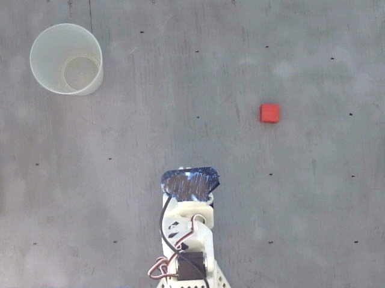
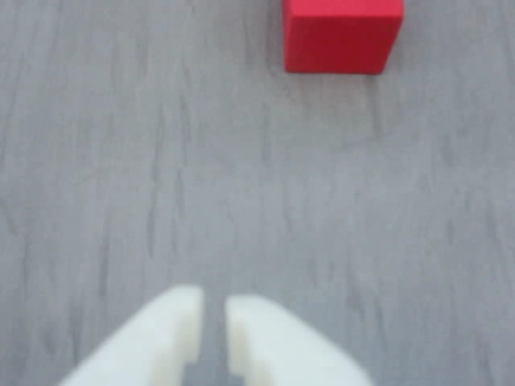
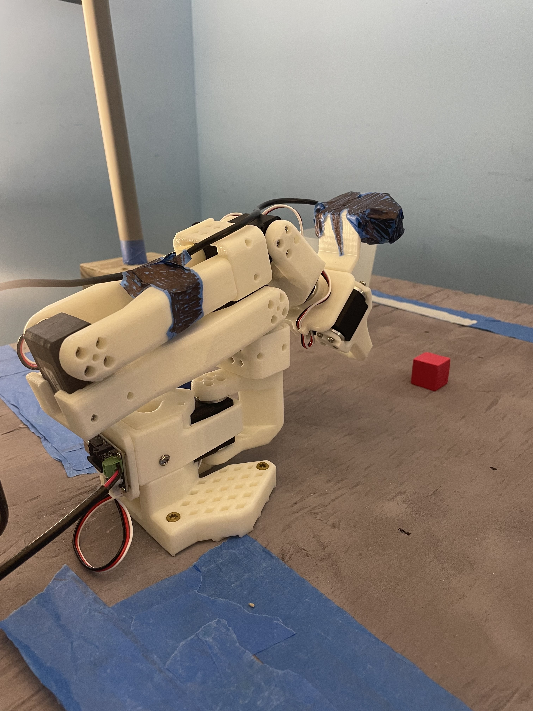
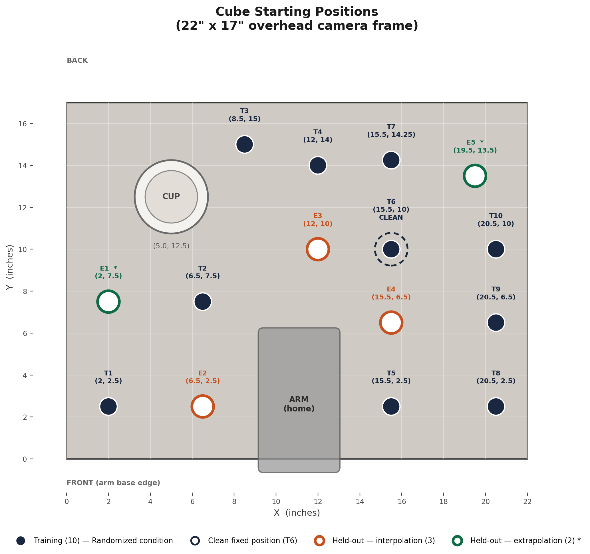
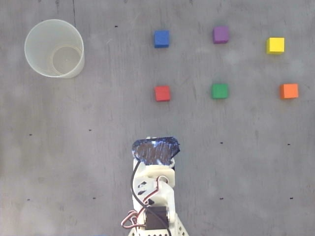
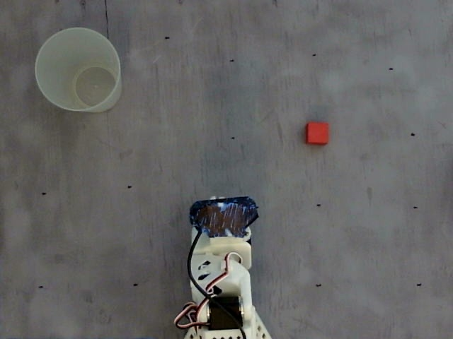
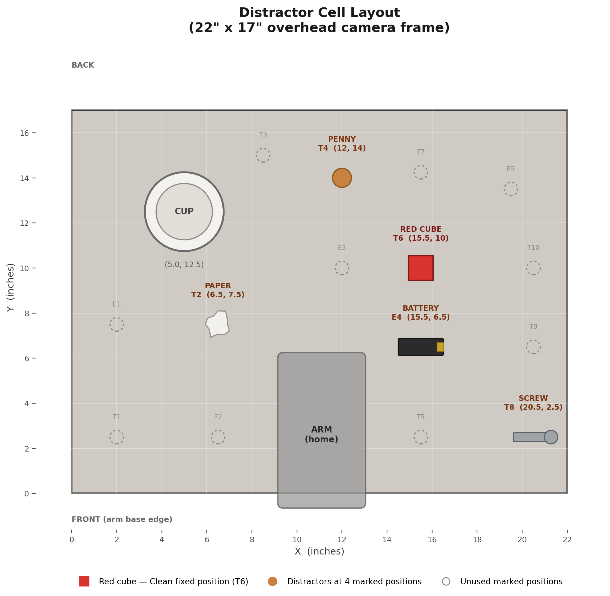
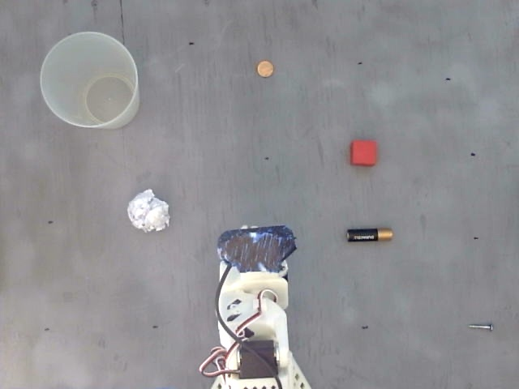

# Pre-registered Protocol for SO-101 Experiment

*Original pre-registration amended August 8, 2026 on the rebuilt workstation, prior to any data
collection. All specifications in §1 through §7 were fixed before the first training episode was
recorded. Amendments 1 through 13 in §8 all predate the first training episode. Amendments 14
onward were made afterwards, each dated and stating which data it precedes.*

## 1. Apparatus

- **Arm:** SO-ARM101 Pro (Feetech STS3215 servos); follower 12 V, leader 5 V teleoperation.
- **Cameras:** Overhead Logitech C270 and wrist Seeed USB webcam, both 640 x 480 @ 30 fps. The
  overhead camera is rigidly mounted on a fixed gantry and captures a **22 x 17 in** area of the
  work surface. Camera position is locked for the duration of the study.
- **Work surface:** Plywood finished in flat gray primer.
- **Cube:** 1 inch foam cube (Teacher Created Resources). All colors are the same product and are
  identical in size, shape, mass and surface finish, only the color differs.
- **Cup:** Plastic cup, 4.5 in tall, 2.5 in diameter at the base, 3.5 in at the rim. Fixed at
  **(5.0, 12.5)** for all conditions and all evaluation cells.
- **Coordinate frame:** Positions are given in inches from the front-left corner of the
  overhead camera frame.
- **Arm base:** The follower is clamped to the front edge (y = 0), centered at **x = 11.0**.
- **Arm home pose:** Every episode begins with the arm fully retracted into its most compact
  configuration, base oriented forward toward the workspace, all joints folded back over
  themselves. The gripper is visible in the overhead frame in this pose.
- **Lighting (baseline):** blinds fully closed, room lights off. Two clamp LEDs
  (**1000 lm each, 4000 K, CRI 80**) bounced off the ceiling, clamped to both sides of the table.
  This is the lighting for all training demonstrations and for four of the five evaluation cells.

The two views the policy receives, at the resolution it receives them:

 
 

Arm home pose:

 

## 2. Cube positions (locked)

 

**Training positions (10)** used by the Randomized condition, 5 demos each:

| ID | (X, Y) | | ID | (X, Y) |
|----|--------|---|----|--------|
| T1 | 2.0, 2.5 | | T6 | 15.5, 10.0 **Clean fixed position** |
| T2 | 6.5, 7.5 | | T7 | 15.5, 14.25 |
| T3 | 8.5, 15.0 | | T8 | 20.5, 2.5 |
| T4 | 12.0, 14.0 | | T9 | 20.5, 6.5 |
| T5 | 15.5, 2.5 | | T10 | 20.5, 10.0 |

**Held-out positions (5)** used only by the New Positions evaluation cell, 3 episodes each:

| ID | (X, Y) | Relation to training convex hull |
|----|--------|----------------------------------|
| E1 | 2.0, 7.5 | **outside** (extrapolation) |
| E2 | 6.5, 2.5 | on the boundary (front edge, between T1 and T5) |
| E3 | 12.0, 10.0 | inside (interpolation) |
| E4 | 15.5, 6.5 | inside (interpolation) |
| E5 | 19.5, 13.5 | **outside** (extrapolation) |

The convex hull of the training positions has vertices (2, 2.5), (20.5, 2.5), (20.5, 10),
(15.5, 14.25), (8.5, 15). Interpolation and extrapolation results are reported separately.

All 15 positions are marked identically on the work surface and are never redrawn. Two additional
marks (P1, P2) were added after all registered rollouts were complete, per §8.15.

## 3. Independent variables (conditions change)

Data-collection strategy, across four conditions. Each varies exactly one factor; all other
factors are held identical to the Clean condition.

1. **Clean:** All 50 demos are identical: red cube at **T6 (15.5, 10)**, baseline lighting, every
   demo a first-try success.
2. **Randomized (position):** Only the cube's start position varies, across the 10 training
   positions in §2, which lie in an irregular region bounded by the cup at the back-left and the
   arm base at the front-center. Positions are cycled T1 through T10 in five complete passes, for
   5 demos per position and 50 episodes total. Cycling rather than blocking prevents drift in
   teleoperator skill over the session from being confounded with position. The Clean position
   (T6) is one of the 10.
3. **Recovery:** Identical to Clean except that 20 of the 50 demos include a deliberate mid-carry
   release, a re-grasp from wherever the cube lands, and completion of the task. The release is
   deliberate rather than a naturally occurring slip, so the learned behavior reflects a clean
   drop whose dynamics may differ from a real failed grasp. The drop is performed at approximately
   the midpoint of the carry (specified as intent; measured post hoc at roughly 65%, see §8.24),
   from a height of **4 to 5 inches** above the surface. Recovery demos are demos 2 and 4 within
   each consecutive group of 5, so recovery behavior is not confounded with teleoperator fatigue.
4. **Color-varied:** Only cube color varies. Five colors for 10 episodes each (red, orange,
   yellow, blue, purple), cycled in that order ten times, for the same reason positions are cycled
   in the Randomized condition. Green is *not* used in training, as it is reserved for evaluation,
   and is removed from the workspace entirely during all training collection.

 

*The five training colors plus the held-out green, as seen by the overhead camera. All six are
clearly separable against the gray primer, which is why the background was changed from blue tape
(see §8.3).*

Because positions and colors are cycled deterministically, the factor level of every episode is
recoverable from its index without separate logging: in the Randomized condition episode *i* uses
position T[((i-1) mod 10) + 1], and in the Color-varied condition episode *i* uses the
((i-1) mod 5)+1'th color of the sequence. When a demonstration is discarded and re-recorded, it is
re-recorded at the same position or color, so this correspondence is preserved.

## 4. Fixed variables (confound control)

1. **Model:** SmolVLA, fine-tuned from lerobot/smolvla_base.
2. **Task:** Pick up a cube and place it in a cup.
3. **Demo budget:** 50 training episodes per condition; 15 evaluation episodes per cell.
4. **Hardware:** Camera position and framing, gripper, control frequency.
5. **Arm home pose** and **baseline lighting** as defined in §1.
6. **Reset procedure:** Between episodes the cube is replaced by hand onto its marked position.
7. **Training hyperparameters:** Identical across conditions: batch_size=32, steps=10000,
   save_freq=2000, LeRobot's default optimizer and learning-rate schedule for SmolVLA,
   policy.device=cuda, and the same rename_map (observation.images.overhead becomes camera1,
   observation.images.wrist becomes camera2). The training seed is identical across conditions
   within a replication and is the only setting varied between replications: seed 1000 for the
   primary run, seed 2000 for the replication (§6.9, §8.14). Conditions are never compared across
   seeds.
8. **Checkpoint selection:** The final checkpoint at step 10000 is evaluated for every condition.
   No best-loss or early-stopped checkpoint is used, so checkpoint selection cannot vary across
   conditions.
9. **Compute:** All training runs execute on a single A100.
10. **Recording window:** episode_time_s = 45 and reset_time_s = 15 for all conditions and all
    cells. During collection the window is a ceiling, not a target: recording ends manually as
    soon as the cube is resting in the cup. The ceiling accommodates recovery demonstrations
    without truncation and matches the 45-second evaluation window in §6.7.
11. **Language instruction:** Verbatim identical for every training demonstration and every
    evaluation rollout: "Pick up the cube and place it in the cup".
12. **Inference settings:** policy.device=mps, strategy.type=episodic,
    strategy.reset_to_initial_position=true, chunk_size=50, n_action_steps=50, dataset.fps=30,
    episode_time_s=45, reset_time_s=15, identical for every policy and every cell. The policy
    executes all 50 actions of a chunk before the next forward pass, so the action-update rate is
    **0.600 Hz**, one decision every 1.67 seconds, independent of how long the forward pass itself takes. 
    Playback therefore shows brief holds at chunk boundaries. The 45-second window is wall clock. 
    Frames are recorded only while a chunk executes, not during the forward pass that produces 
    the next one, so a full-length episode is 1151 recorded frames, 38.4 seconds of motion in 23 chunks. 
    Every duration computed from the recorded data is execution time, not elapsed time. The residual, 
    6.6 seconds over 23 chunks, puts the forward pass at roughly 290 ms on this hardware.
13. **Warmup episodes:** Each cell records 16 episodes; index 0 is discarded as a warmup and never
    scored, so the 15 scored episodes are indices 1 to 15. The first forward pass in a process
    pays a one-off Metal kernel compilation cost that later passes do not, which would otherwise
    systematically penalise the first episode of every cell. The size of that cost was not logged
    and varied between runs. The rule is pre-committed (§8.13), unconditional, and independent of
    the episode's outcome, so it stands regardless of how large the cost was on any given run.

Changing any of these mid-study invalidates the comparison. Held-out rule: evaluation instances
(positions, colors) differ from those seen in any training condition.

## 5. Evaluation

All four trained policies are evaluated across five cells: one in-distribution (reference) and
four held-out.

1. **In-distribution (reference):** Only the cup and red cube on the testbed, baseline lighting,
   cube at T6, identical across all 15 episodes.
2. **New Positions:** The cube starts at the 5 held-out positions, in order, 3 episodes each.
   Results are reported overall and split by interpolation (E2, E3, E4) versus extrapolation
   (E1, E5). E2 lies exactly on the front edge of the training convex hull and is grouped with
   interpolation. The held-out position identifier is recorded for every episode.
3. **Reduced Lighting:** The left LED is switched off; the right is unchanged in position,
   orientation and output. Blinds stay closed and room lights stay off, as in baseline. Mean
   grayscale intensity of the overhead frame falls from **144.8 to 101.0**, a 30% reduction in the
   recorded image. Because the cameras auto-expose, that is a lower bound on the reduction in
   illumination at the surface. The manipulation is therefore both a reduction in illumination and
   a shift from symmetric to one-sided lighting, which changes the direction and depth of shadows
   across the workspace. The cube is at T6 and the same fixture is switched off for all 15
   episodes and all four policies.

 
 

*Baseline (both LEDs, left) and Reduced Lighting (one LED, right), as recorded by the overhead
camera.*

4. **Different object (new color):** The red cube is replaced with a green cube of the same 1 inch
   foam type, at T6, with baseline lighting and background, for 15 episodes.
5. **Distractors:** Four distractor objects at fixed marked positions, identical across all 15
   episodes:

 
 

   | Object | Position |
   |--------|----------|
   | crumpled paper | T2 (6.5, 7.5) |
   | penny | T4 (12.0, 14.0) |
   | battery | E4 (15.5, 6.5) |
   | screw | T8 (20.5, 2.5) |

   The red cube starts at T6 under baseline lighting; only the distractors change. The objects
   span a range of size, shape, color and material. Three of the four sit at Randomized training
   positions (T2, T4, T8), making the cell adversarial specifically for that policy, while the
   other three conditions, trained only at T6, see them as unfamiliar objects in the scene. The
   asymmetry is intentional and is accounted for when interpreting the cell.

## 6. Pre-committed metrics

1. Task success rate per (condition x eval cell).
2. Per-cell success rate reported with Wilson 95% confidence intervals.
3. Each evaluation cell is 15 episodes.
4. Primary comparison is the **generalization gap:** in-distribution success minus mean held-out
   success.
5. **Matched-axis comparisons (key results):** Randomized vs Clean on New Positions, and
   Color-varied vs Clean on Different-object. Each is reported as a difference in success rate
   with a Newcombe hybrid score interval on the difference and a Fisher exact test. Reduced
   Lighting and Distractors are cross-transfer cells that no condition trained on; for these we
   report whether any condition generalizes to an unseen axis.
6. **Success** occurs when the robot picks up the cube and releases it into the cup where it
   rests, with the cup remaining upright.
7. An **episode** is a 45-second window in which the arm may complete the task. If the success
   criterion (#6) is met, the episode is scored a success and terminated; otherwise, after 45
   seconds it is scored a failure and reset. If the cube misses the cup, the arm may retry within
   the allotted time. Knocking the cup over is an immediate failure (the policy is not trained to
   correct it). If the cube is knocked outside the testbed or out of the reachable-and-visible
   area such that the task can no longer be completed, the episode is scored a failure and reset.
8. **Scoring:** Episodes are scored live by the experimenter against criterion #6 at the time of
   the rollout. All rollout video is retained; any episode judged ambiguous at the time is flagged
   and re-scored from video before analysis. For New Positions episodes the held-out position
   identifier (E1 to E5) is recorded alongside the score.
9. **Seeds:** One training seed per condition (seed=1000) is run first and reported. Additional
   seeds (up to three per condition) will be added if time permits. The number of seeds actually
   run is reported for every condition (see §8.14 for the seed 2000 replication as run). No
   analysis or claim is conditioned on how many seeds are obtained.

## 7. Dataset and policy naming (locked)

**Training datasets:** `cube-pickup-{clean,randomized,recovery,color}_{YYYYMMDD_HHMMSS}`.
`lerobot-record` appends the timestamp automatically; where a condition was collected more than
once, the timestamp is the disambiguator and the retained dataset is named explicitly in §8.

**Policies:** `smolvla-cube-{condition}` for the seed 1000 replication and
`smolvla-cube-{condition}-seed2000` for the seed 2000 replication. Exploratory policies outside
the four-condition grid carry a descriptive suffix (`smolvla-cube-color-slowpace`).

**Rollout datasets:** `rollout_{policy}_{cell}_{timestamp}`, retained for offline analysis.

## 8. Amendments to the original pre-registration

*Amendments 1 to 13 predate all data collection on the rebuilt workstation. 14 to 17 were made
after the seed 1000 grid and before the seed 2000 grid. 18 to 28 are analysis-stage and follow the
completed two-seed grid. Each is dated and states which data it precedes. Supporting measurements
for the analysis-stage entries are reported in `analysis/README.md`.*

### Before any data was collected (August 8, 2026)

1. **Workspace geometry.** The reachable in-frame region is irregular, so the original "4 corners
   and 6 interior spots" was replaced by the 10 training and 5 held-out positions in §2.
   Interpolation and extrapolation status is now reported, which the original did not specify.
2. **Color-varied rebalanced** from red x14 with three colors x12 to five colors x10, adding
   orange, for a balanced design.
3. **Background** changed from blue masking tape to gray primer. A blue cube on blue tape had poor
   contrast and would have confounded the Color-varied condition.
4. **Lighting cell** reduced from three levels (normal, dim, bright) to one Reduced Lighting
   level. No source brighter than baseline was available and "normal" is already the
   in-distribution cell. One LED is switched off rather than both, since both off leaves the
   workspace effectively unlit and would test response to absent visual input rather than
   robustness to a lighting change. Verified before collection to give a 30% reduction in recorded
   image brightness (§5.3).
5. **Scoring** changed from post-hoc video review to live scoring, with all video retained for
   auditing and for ambiguous cases.
6. **Seeds** wording changed to commit to reporting the number of seeds run rather than to a
   number; the seed value fixed at 1000.
7. **Recovery condition** given an operational definition (drop point and height), which the
   original left unspecified.
8. **Demo ordering** specified as cycling rather than blocking, so the manipulated factor is not
   confounded with drift in teleoperator skill within a session.
9. **Recovery demo placement** moved from the last 20 demos to demos 2 and 4 of each group of 5,
   so recovery behavior is not confounded with operator fatigue.
10. **Training hyperparameters, seed and checkpoint selection** added to §4; the original left all
    four unspecified.
11. **Recording window and language instruction** added to §4. The original risked truncating
    recovery demos and did not fix the instruction string, which is a model input.
12. **Matched-axis comparisons** now specify an interval on the difference and a Fisher exact
    test. The original committed only to per-cell Wilson intervals, and overlapping intervals are
    not a test of a difference between two rates.
13. **A 16th warmup episode** per cell added and pre-committed to be discarded, before any
    evaluation episode was recorded.

### After the seed 1000 grid, before the seed 2000 grid (August 11, 2026)

14. **Seed 2000 replication.** The full 20-cell grid is repeated with the seed 2000 policies,
    trained August 9 with identical settings. Results are reported per seed and never pooled.
    Cells run in a fixed order decided in advance (In-Distribution, Different Object, Distractors,
    Reduced Lighting, New Positions), independent of any observed outcome. The physical scene is
    unchanged from the seed 1000 grid. Stated before any seed 2000 data was recorded.
15. **Displacement probe, exploratory.** Clean at both seeds is evaluated at P1 (15.5, 9.0) and P2
    (15.5, 8.0), on the line from T6 to E4, 8 scored episodes each. The registered held-out set
    places every position at least 3.5 in from T6, so 0/60 on New Positions cannot distinguish a
    near-zero generalization radius from a boundary inside that gap. Stated before the probe was
    run. *Deviation, logged August 13: the marks were not erased and no post-erasure photograph
    was taken. They were added only after all 600 registered and 30 slowpace rollouts, so they
    appear solely in the 32 displacement-probe episodes, where their presence is part of the
    manipulation.*
16. **Demonstration pace probe, exploratory.** The superseded Color collection
    (`cube-pickup-color_20260809_130649`, 23.0 s per demonstration) and its policy
    `smolvla-cube-color-slowpace` are evaluated on In-Distribution and Different Object against the
    retained Color policy (16.6 s). The two are separate collection sessions, so pace is the
    measured difference but not the only one. Outside the pre-registration and never pooled into
    the grid. Stated before the probe was run.
17. **Failure-mode vocabulary fixed.** Live free-text failure notes were normalised against a
    nine-term vocabulary: success, success_after_recovery, no_departure, contact_no_grasp,
    grasp_drop, deliberate_drop, cube_out_of_bounds, cup_knocked, timeout_other. Binary success
    values were fixed at the time of each rollout and none changed during normalisation.
    Superseded by §8.21 and §8.27.

### Analysis stage, after the two-seed grid (August 12 to 14, 2026)

18. **Color-varied re-collected, August 9**, before any Color policy was trained. The teleoperator
    had deliberately slowed the first collection to match the episode length of the conditions
    already recorded, and overshot: 23.0 s per demonstration against 18.6 s for Clean, so pace
    rather than color would have been the largest difference between that dataset and the rest. It
    was re-collected the same day with no timing control, matching the procedure used for the
    other three conditions. Retained dataset: `cube-pickup-color_20260809_183224` (16.6 s). The
    superseded collection was not deleted and is reused as the pace probe (§8.16); no episode from
    it enters any four-condition analysis.
19. **Randomized collection interrupted and resumed, August 10.** The session crashed after 41
    recorded episodes (index 0 to 40) and resumed at the next index with the cube at T2, the
    position the §3 cycle assigns to it, with no change to environment, lighting, camera geometry
    or teleoperator. The index to factor-level mapping was confirmed against the recordings and
    independently against the position calibration in §8.23, which recovers all ten positions with
    tight within-position clustering.
20. **Re-record rules, stated August 10:** *Demonstrations:* §3 specifies that every
    demonstration is a first-try clean success, so a demonstration judged not clean at the time
    was discarded and re-recorded. That implements the specification rather than deviating from
    it, but the judgement was made in the moment without a written rubric and the count was not
    logged. A demonstration is also re-recorded for pre-outcome faults: a dropped teleoperation 
    link, the cube off its mark at the start, a stray object on the work surface, or a control 
    misfire. Every re-record uses the same position or color as the take it replaces, 
    preserving the §3 correspondence.

    *Evaluation:* approximately five rollouts were re-recorded, and fewer than ten. The exact
    count was not logged and is not recoverable, because a re-record replaces the discarded take
    rather than storing it alongside. One was re-recorded because a pencil had been left in the
    overhead frame, so the scene did not match the cell specification in §5. One is the
    outcome-dependent case logged in §8.26. The remainder were control misfires, where a
    right-arrow press as an episode ended made the harness prompt for a recording and a reset at
    once and the next episode never started; no inference ran and the arm was completely inert,
    which is how a misfire is told apart at the time from a scored `no_departure` episode, in
    which the policy runs and the arm vibrates slightly without departing.
21. **Vocabulary corrected and extended.** The §8.17 vocabulary conflated two outcomes and used
    "recovery" for the case that is *not* the Recovery condition's demonstrated behavior. Both
    terms were renamed:
    - **success_after_missed_grasp** (was success_after_recovery): the initial grasp failed, the
      policy re-approached and completed the task; the cube was never held and released.
    - **success_after_drop** (was success_after_regrasp): the policy grasped the cube, released it
      during the carry, recovered it and completed the task, reproducing the demonstrated Recovery
      behavior.

    Both score as successes and no binary success value changed. The split is supported by the
    data: all six success_after_drop episodes come from a single policy (recovery-seed2000) while
    the six success_after_missed_grasp episodes are spread across four policies, and the release
    detector separates the two families in the same direction. Six success_after_drop episodes
    occurred at seed 2000 and none at seed 1000.
22. **Instrument validation of the live labels, post hoc.** Three label families were checked
    against joint telemetry from the same episodes: `no_departure` against arm-joint departure,
    the drop labels against a gripper release detector calibrated on the recovery demonstrations,
    and the joint-to-bearing calibration against two independently known locations, the cube at T6
    and the cup. One episode was recoded. Recall, specificity, calibration error and the
    detector's blind spot are reported in `analysis/README.md`.
23. **Azimuth-based trajectory analyses declared exploratory.** Base rotation is mapped to
    workspace bearing by a linear fit on the 50 Randomized training grasps, whose cube positions
    are known. Four analyses use it: trajectory envelope, per-cell aim invariance, aiming error by
    interpolation versus extrapolation, and release bearing. All are post hoc, none were
    pre-registered, all are reported as exploratory, and all derive from the recorded `action`
    column, which is commanded rather than achieved joint position (§9). The 2D joint-to-position
    map is too weak to use quantitatively, so radial claims are stated in joint angles only. Fit
    coefficients and validation error are in `analysis/README.md`.
24. **Correction to §3.** The recovery drop was specified at approximately the midpoint of the
    carry; measured across the 20 recovery demonstrations it sits at roughly 65%. §3 described
    intent, execution was consistently later. The Recovery policy's own releases land within one
    degree of the demonstrations, so the inheritance claim is unaffected. §3 is left as written.
25. **Correction to §4.12.** The section originally stated roughly 3 Hz at approximately 25 fps.
    With n_action_steps = 50 and dataset.fps = 30 the true action-update rate is 0.600 Hz, one
    decision every 1.67 s. The underlying settings were fixed before collection and are unchanged;
    only the derived description was wrong. The corrected figure is used throughout the analysis.
26. **One evaluation episode re-recorded on an outcome-dependent judgement** (randomized, seed
    1000, in_distribution, episode 2), logged August 13, 2026. The arm did not depart from the
    home pose, and the experimenter, unsure at the time whether an episode in which the arm never
    moves counts as a scored episode, re-recorded it. Unlike the three misfires in §8.20 this was
    not outcome-independent, which is why it is logged separately. §6.7 already answers the
    question: an episode that does not meet the criterion inside the window is a failure whether
    or not the arm moved. Both takes scored a failure, so the binary success value is unchanged;
    the retained take departed and timed out, so one episode moves from `no_departure` to
    `timeout_other`. The rule is stated explicitly here: an episode in which the arm does not
    depart is a valid, scored, failed episode, which is how all 50 `no_departure` episodes are
    treated.
27. **Success labels audited, one transposed pair corrected, August 14, 2026.** Every scored
    episode was screened against two telemetry criteria independent of the label being tested:
    episode duration (a success is terminated when achieved, a failure runs the window out), and
    the presence of a gripper release inside the cup's angular half-width. Two adjacent episodes
    were flagged, color / in_distribution / seed 1000 / episodes 8 and 9, and both were re-scored
    from video under §6.8. Their labels were transposed: 8 is a `contact_no_grasp` failure and 9
    is a success. Episodes 10 and 11 were also reviewed and match their labels, ruling out a wider
    offset in the cell. Because the swap exchanges one success for another inside the same cell,
    no success rate, interval or test statistic anywhere in the study changed. No other episode in
    the 662 was flagged by either screen. This supersedes the statements in §8.17 and §8.21 that
    no binary success value was ever changed: two were, both identified by telemetry rather than
    by inspecting outcomes.
28. **Vocabulary precedence rule, August 14, 2026.** §8.17 did not say which term applies when two
    fit. An episode is labelled by its first decisive event: a cube that was held and then
    released is `grasp_drop` regardless of where it came to rest, and `cube_out_of_bounds` is
    reserved for episodes in which the cube leaves the workspace without ever having been held.

## 9. Known limitations

- **Power.** At 15 episodes per cell only large differences are detectable. Across the two seeds
  no within-condition difference is significant and the intervals are roughly ±14 points wide, so
  a difference under about 13 points is unresolvable whatever its source. Null results are
  reported as inconclusive, not as evidence of no effect.
- **Two seeds** per condition, reported separately and never pooled. Two replications bound
  training-run variance loosely at best; per-cell Wilson intervals capture episode-level
  uncertainty only.
- **The generalization gap metric is bounded above by the in-distribution rate**, so a condition
  that performs poorly in distribution cannot show a large gap. Reported as pre-registered, with
  per-cell rates alongside.
- **Extrapolation is modest.** The held-out positions lie a few inches beyond the training
  envelope, still within reach and camera frame. The interpolation and extrapolation split rests
  on 9 and 6 episodes per seed and is descriptive rather than a formal test.
- **The effective task window is shorter than the nominal one.** The 45 s window is wall clock and
  the arm is in motion for about 38 s of it, identically for every policy and cell (§4.12).
- **Illumination is specified by fixture and state, not by a photometric measurement.** No
  calibrated light meter was available, so lighting is pinned by fixture type, output, colour
  temperature, position and on/off state, and the manipulation is quantified by the change in
  recorded image brightness (§5.3).
- **The cameras auto-expose**, so the Reduced Lighting cell tests reduced brightness, one-sided
  shadow structure and exposure noise together rather than illumination alone. LED color rendering
  index is 80, which is relevant to the Color-varied condition.
- **Distractors sit at trained cube positions** rather than random ones, making that cell
  adversarial by construction and adversarial to a different degree for Randomized.
- **Scoring is not blinded.** The criterion is binary and physically unambiguous and all video is
  retained, so any episode can be re-scored or audited; §8.27 reports that audit. Blinded scoring
  was not feasible for a single-operator study.
- **The budget is fixed in episodes, not frames.** Frame counts differ by 29% across conditions,
  so each sees between 9.9 and 12.9 passes over its own data at a fixed 10,000 steps. Episode
  count was chosen because it is what an experimenter actually controls.
- **Demonstration pace was not controlled** and spans 16.6 to 21.4 s per demonstration across the
  four conditions. §8.16 shows pace is not obviously inert, and the one attempt to control it
  (§8.18) made the difference larger. No claim here separates pace from the manipulated factor.
- **Partial observability at T1, T8, T9 and T10**, where the gripper leaves the overhead frame
  during part of the approach while the wrist camera stays on target. Affects the Randomized
  condition only, at four of its ten positions, and follows from the fixed camera geometry.
- **Everything measured from the `action` column is commanded, not achieved.** For aiming that is
  arguably the quantity of interest, but it means gripper telemetry cannot distinguish a closure
  blocked by the cube from a closure on empty air. Claims about whether the cube was held rest on
  the live notes and retained video.
- **The release detector under-counts rather than over-counts.** Thresholds were fixed by sweep on
  labelled demonstrations before any rollout was processed, and it cannot see drops occurring
  within 10 degrees of the grasp, which biases the drop-location estimate toward the cup. Recall
  and the four verified misses are in `analysis/README.md`.
- **The azimuth analyses (§8.23) are post hoc** and reported as exploratory; no pre-registered
  claim depends on them.
- **Probing activations are replayed from encoded video** rather than live camera frames;
  agreement with the recorded actions was verified against the policy's own sampling noise.