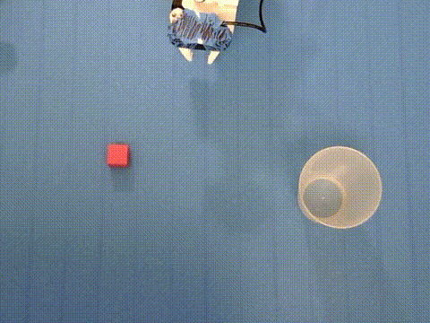
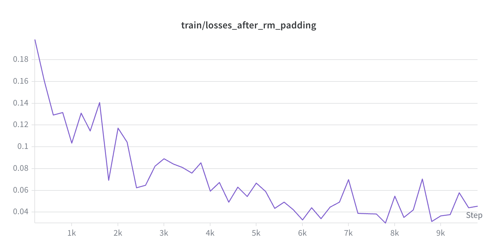

# SO-101 × SmolVLA: How Demonstration-Collection Strategy Shapes Generalization

A controlled empirical study on a self-built low-cost robot arm (Seeed SO-ARM101,
LeRobot platform) using the SmolVLA vision-language-action model.

  

## The question
A VLA learns to map camera images and a language instruction directly to robot motion,
end-to-end from demonstrations, with no hand-coded perception or inverse kinematics. This
project asks: how does the way you collect demonstrations affect how well the learned policy
generalizes to conditions it never saw?

## Demo

The clip above is the **overhead camera view** during autonomous inference. The leader is
disconnected and the policy is driving the follower arm on its own. It receives only the two
camera feeds (overhead and wrist) and the instruction *"Pick up the cube and place it in the
cup."* and outputs motion directly, with no hand-coded perception, planning, or teleoperation.

This is one in-distribution rollout from the Color-varied policy at seed 1000, played at 2x.
The cube is at the trained position T6 under baseline lighting, and the policy picks it up and
releases it into the cup inside the 45-second window. The four policies already separate here,
before anything is held out: across both seeds Clean succeeds 30 of 30 in distribution, Color 25
of 30, Recovery 17 of 30 and Randomized 12 of 30. The question the study asks is what happens
when any one thing changes, and the answer differs sharply by how the demonstrations were
collected.

## Design
See [PROTOCOL.md](PROTOCOL.md) for the full pre-registered protocol and
[RUN_SHEET.md](RUN_SHEET.md) for the as-run record.

Fix the model (SmolVLA), the task (pick up a cube and place it in a cup), the demo budget
(50 episodes per condition), and the training hyperparameters. Vary only the data-collection
strategy, one factor at a time:

| Condition | What varies |
|---|---|
| **Clean** | nothing: red cube, one fixed position, every demo a first-try success |
| **Randomized** | cube start position, cycled over 10 marked positions |
| **Recovery** | 20 of 50 demos include a deliberate drop during the carry |
| **Color-varied** | cube color, cycled over five colors; green held out for evaluation |

 

All four policies are then evaluated on the same five cells: one in-distribution reference plus
four held-out (new positions, reduced lighting, unseen object color, distractors), at 15 scored
episodes each (16 recorded, index 0 discarded as warmup), for 300 rollouts per seed and 600
registered rollouts across two training seeds. A further 62 rollouts were recorded for two
exploratory probes (displacement and demonstration pace) and are reported separately, never
pooled into the grid. Held-out positions are split into interpolation and extrapolation relative
to the convex hull of the training positions and reported separately.

The protocol was pre-registered before any study data was collected. Amendments made on the
rebuilt workstation are listed, dated and justified in
[§8](PROTOCOL.md#8-amendments-to-the-original-pre-registration).

## Results

> The full analysis is to written up in the paper expected by August 20th. This
> section stays high level until that draft is final. Every quantity regenerates from the raw
> scores with the commands in [SETUP.md](SETUP.md#analysis).

Across 600 registered rollouts both pre-registered comparisons are null on success rate, and
**New Positions is 0/15 for every policy at both seeds, 0 of 120**. The interesting part is what
the telemetry shows underneath that.

**Six of the eight policies aim at the trained cube position even in the cell where the cube is
somewhere else.** Their median commanded bearing moves by 0.2 to 2.3 degrees across all five
evaluation cells. Only the position-randomized policy's aim moves with the cube, by 10.2 and 24.3
degrees, and inside the training hull it localises to within two thirds of a cube width. It
converts none of that into task success: it is the worst policy in the grid, 12/75 and 13/75.

**The clean-data policy's reach is a fixed sweep.** It turns to about 27 degrees whatever is in
front of it. That clears the trained cube position by 2.8 degrees, clears a one-inch displacement
by 0.4 degrees at one seed and misses it by 0.02 at the other, and falls 1.7 degrees short of a
two-inch displacement. Episodes reaching the cube go 15/15, then 6/8 and 4/8, then 0/8 at both
seeds. The policy is not failing to localise the cube, it is not looking for it.

**Recovery inherits the release point exactly.** Its dropped cubes land at a median bearing of
-11.7 degrees against the demonstrated -10.8, one degree apart against a calibration accurate to
0.86 degrees, both about 65% of the way from cube to cup. It inherits the first half of the
demonstrated behaviour and not the second: 6 episodes in 600 completed the re-grasp that follows
the drop in every demonstration.

Tables in `figures/table1.md`, the analysis map in [analysis/README.md](analysis/README.md), raw
scores in `documents/results_raw_two_seeds.xlsx` (662 scored episodes, one row each).

## Hardware
- Seeed SO-ARM101 Pro (leader 5 V / follower 12 V), Feetech STS3215 servos
- Two USB cameras: Logitech C270 overhead on a fixed gantry, Seeed webcam at the wrist, both
  operated at **640 × 480 @ 30 fps**
- Work surface in flat gray primer; two 1000 lm / 4000 K clamp LEDs bounced off the ceiling
- MacBook Air for collection and inference; Colab A100 for training

 
 

*The only two inputs the policy receives, at the resolution it receives them: overhead (left) and
wrist (right), both 640 x 480.*

## Pipeline
1. `scripts/record_dataset.sh`: teleoperate and record synchronized camera and joint data
2. Train SmolVLA on a cloud GPU (fine-tune from `lerobot/smolvla_base`), log to Weights & Biases
3. `scripts/run_inference.sh`: trained policy drives the arm autonomously
4. `tools/export_results.py` then `analysis/`: regenerate every reported number from the scores

## Repository layout

| Path | Contents |
|---|---|
| `scripts/` | collection, inference and camera bring-up shell scripts |
| `tools/` | camera checks, episode playback, and the motion and geometry analyses |
| `analysis/` | pre-committed statistics, exploratory analyses, figure generation |
| `probing/` | activation extraction and linear probes (extracted activations are gitignored) |
| `documents/` | raw scores and the derived CSVs |
| `figures/` | generated tables and figures for the paper (`make_figures.py`) |
| `media/` | photographs and camera frames referenced by the docs |

`analysis/README.md` maps each script to the numbers it produces. Two tools worth knowing about
outside the pipeline: `tools/check_cameras.py`, a headless-safe camera probe that saves a frame
from each camera so framing can be verified before recording, written because LeRobot's OpenCV
build cannot open a live preview window; and `tools/show_episode.py`, which plays a single
episode out of LeRobot v3's chunked video files.

## Status
- [x] Hardware assembled and calibrated
- [x] Teleoperation verified (leader → follower mirroring)
- [x] Pilot dataset recorded, SmolVLA fine-tuned, first autonomous pick
- [x] Workstation rebuilt; protocol pre-registered and amended before collection
- [x] Four-condition data collection (200 demonstrations retained; Color re-collected, see
      [PROTOCOL.md §8.18](PROTOCOL.md#8-amendments-to-the-original-pre-registration))
- [x] Eight training runs (four conditions × two seeds), plus one exploratory policy
- [x] Evaluation grid complete (600 registered rollouts across two seeds) and analysed
- [ ] Paper draft

## Pilot results (superseded by the study)

> **These results come from the previous workstation and are not part of the study.** The bench
> was rebuilt in August 2026 with different camera geometry and a gray work surface in place of
> blue tape, so the pilot data is no longer distribution-matched and is **not** mixed with study
> data. It is kept here because it established that the pipeline works end to end, and because
> the failure it exposed is what motivated the study.

Closed the full pipeline end-to-end: teleoperated data collection, SmolVLA fine-tuning
(10k steps, single A100), autonomous inference on the real arm. The policy reliably picks and
places when the cube is at the trained position (4 consecutive successes).

When the cube was moved off the trained position, the policy reached and missed repeatedly. This
was a direct, observed instance of the generalization gap that the four-condition study is
designed to measure. The clean-data policy nails the in-distribution pose and degrades off it.

 

Training loss (`train/losses_after_rm_padding`) fell from ~0.19 to ~0.045 over 10k steps,
plateauing around step 6k, the policy converged well within the run.

**Pilot artifacts:** [dataset](https://huggingface.co/datasets/Andresg324/cube-pickup-clean_20260723_151726) · [trained model](https://huggingface.co/Andresg324/smolvla-cube-clean-pilot) (superseded; study artifacts will be linked here as they are published)

## Limitations & observed failure modes
1. **No position generalization:** trained only on the clean (fixed-position) condition, the
   policy reliably fails to grasp when the cube starts outside its trained pose. This is the
   motivating observation for the four-condition study.
2. **Setup-tied:** the policy is bound to the exact camera framing, lighting, background and work
   surface it trained on. This is not incidental, it is why the pilot data was discarded rather
   than reused when the workstation was rebuilt, and why all four conditions are collected on the
   same bench without moving the camera.
3. **Scope:** one arm, one task, 50 demonstrations per condition; results are suggestive, not
   conclusive.
4. **Two training seeds per condition** (1000 and 2000), reported separately and never pooled.
   Two seeds bound training-run variance loosely; per-cell confidence intervals capture
   episode-level uncertainty, not training-run variance. See
   [PROTOCOL.md §9](PROTOCOL.md#9-known-limitations) for the full list.

## Reproducing
Requires the LeRobot environment (Python 3.12). See [SETUP.md](SETUP.md).